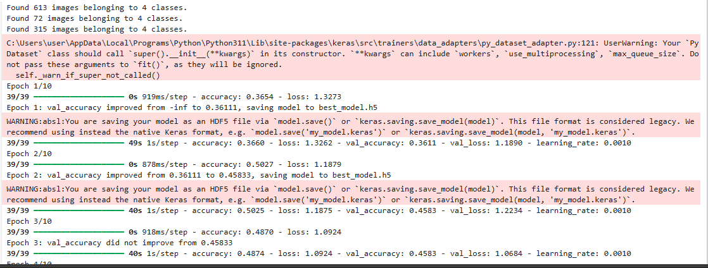
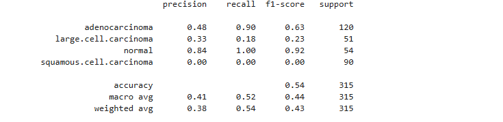
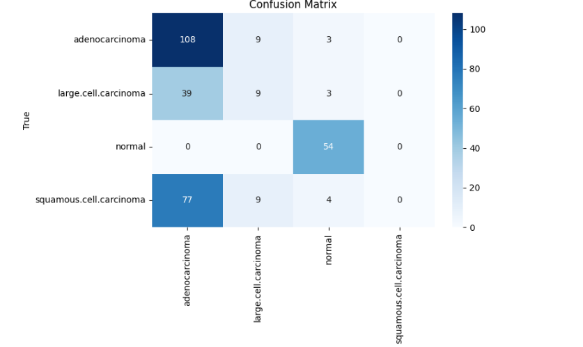
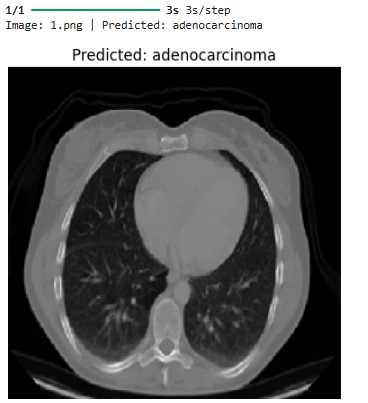
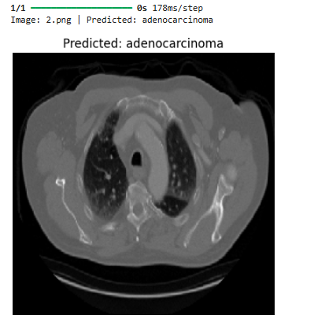
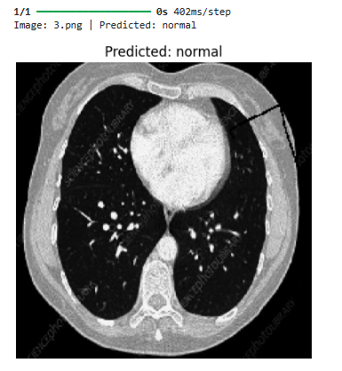
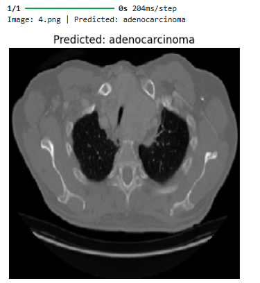

# CT Scan Lung Cancer Detection

### Overview
This project uses a deep learning model (ResNet50 with transfer learning) to detect lung cancer from CT scan images, classifying them into 4 categories. It includes data augmentation, model checkpointing, and performance evaluation tools.

### Features
- ResNet50 as the base model with transfer learning
- Two-phase training:
  - **Phase 1**: Train top layers with the base frozen
  - **Phase 2**: Fine-tune upper base layers
- Data augmentation for better generalization
- Learning rate scheduling & checkpointing
- Evaluation with classification report & confusion matrix

### Requirements
- Python 3.6+
- TensorFlow 2.x
- scikit-learn
- matplotlib
- seaborn
- numpy

### Training Process
The model training occurs in two phases:
1. **Initial Training**: Only train the new top layers while keeping the ResNet50 base frozen
2. **Fine-Tuning**: Unfreeze the top layers of ResNet50 and continue training with a lower learning rate

### Outputs
- `best_model.h5`: Saved model with the best validation accuracy
- Classification report showing precision, recall, and F1-score
- Confusion matrix visualization

### Acknowledgments
- TensorFlow/Keras for model development
- Pretrained ResNet50 (ImageNet)
- scikit-learn for evaluation
